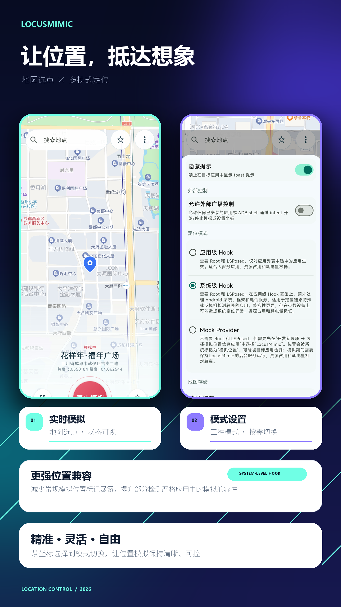

# LocusMimic（位置模拟）

[English below](#english)

LocusMimic·位置模拟 是一款面向已 Root Android 设备的 Xposed/LSPosed 定位模拟模块。它支持地图选点、地点搜索、常用地点收藏、位置参数配置，并可向用户在 LSPosed 中选择的目标应用提供模拟位置。

本项目在 [noobexon1/XposedFakeLocation](https://github.com/noobexon1/XposedFakeLocation) 和 [auag0/HideMockLocation](https://github.com/auag0/HideMockLocation) 基础上继续改造，以满足个人需求

本项目仅用于合法测试、应用调试以及设备所有者明确授权的场景。

## 功能概览

- 支持 LSPosed 中选定的作用应用提供配置的模拟位置。
- 支持地图选点、地点搜索、收藏地点和当前位置定位等功能。
- 支持配置用户自行申请的百度地图浏览器端 AK。
- 支持可配置经纬度、精度、海拔、速度与随机偏移等位置参数。
- 支持三种定位模式：应用 Hook、系统 Hook 与 Mock Provider。

## 应用界面与功能概览

  

## 开发说明

本项目约 99% 的实现由 AI 辅助完成。维护者负责需求定义、代码审阅及实际测试。欢迎通过 Issues 提交 Bug 报告或功能建议；维护者将根据优先级和维护能力评估处理，不保证修复或实现（手动滑稽）。

## 定位模式与要求

| 模式 | 适用场景 | 要求 |
| --- | --- | --- |
| 应用 Hook | 只向 LSPosed 中选定的作用应用提供位置 | Root、LSPosed/Xposed，并启用模块及目标作用域 |
| 系统 Hook | 测试系统框架或电话服务相关的位置链路 | Root、LSPosed/Xposed；仅在确有测试需要时选择系统框架或电话服务 |
| Mock Provider | 不使用 Root/LSPosed 的本地模拟备用方式 | Android 开发者选项中授予模拟位置信息应用权限；系统会标记模拟位置 |

三种模式同一时间只能启用一种，切换模式后建议重启设备。请只选择测试所需的最小作用域，避免勾选无关应用或系统组件。

## 安装与使用

1. 从 [GitHub Releases](https://github.com/wchunlin1006/LocusMimic/releases/latest) 下载与版本对应的 APK 并安装。
2. 使用应用 Hook 或系统 Hook 时，在 LSPosed 中启用 LocusMimic，并仅勾选需要测试的作用域。
3. 打开 LocusMimic，在地图上选点或通过搜索选择位置；按需调整位置参数。
4. 选择一种工作模式后点击“开始模拟”。
5. 结束测试后点击“停止模拟”；如目标应用未立即刷新，强制停止并重新打开该应用。

## 隐私与外部控制

地图显示和地点搜索通过百度地图 JavaScript API 提供，因此会产生与地图服务相关的网络请求。

“允许外部广播控制”默认关闭。开启后，任何已安装应用或 `adb shell` 都可通过 Intent 开始/停止模拟或设置坐标；仅在你明确需要本地自动化时开启。接口与安全边界见 [docs/EXTERNAL_CONTROL.md](docs/EXTERNAL_CONTROL.md)。

## 发布与贡献

- [发布说明](docs/PUBLISHING.md)
- [发布流程](docs/RELEASE_PROCESS.md)
- [变更记录](更新日志.md)
- [贡献说明](CONTRIBUTING.md)
- [上游改造说明](docs/FORK_CHANGES.md)
- [Telegram 频道](https://t.me/LocusMimic)

提交 Issue 时请提供设备/ROM、Android、Root 方案、LSPosed 版本、模块版本、作用域、复现步骤以及必要的 LSPosed 日志或 Logcat，并注意移除账号、地址与其他敏感信息。

## 合规说明

本项目仅用于合法、已授权的测试、开发调试、学习研究等场景。请勿将其用于绕过平台规则、虚假打卡签到、获取不当利益、干扰服务、侵犯他人权益或任何违法违规用途。使用前请确认你对目标设备、账号、应用和使用场景拥有合法授权，并自行承担使用后果。

## License 与上游归属

本项目遵循 [MIT License](LICENSE)。在 [noobexon1/XposedFakeLocation](https://github.com/noobexon1/XposedFakeLocation) 与 [auag0/HideMockLocation](https://github.com/auag0/HideMockLocation) 的基础上继续改造；请保留许可证和相应上游归属。

---

## English

LocusMimic is an Android location-simulation module for rooted devices using Xposed/LSPosed. It provides map selection, place search, favourites, configurable location parameters, and scoped simulated locations for selected apps. It is maintained as a personal fork of [XposedFakeLocation](https://github.com/noobexon1/XposedFakeLocation) and [HideMockLocation](https://github.com/auag0/HideMockLocation).

### Features

- Provides configured simulated locations to selected LSPosed app scopes.
- Supports map selection, place search, favourite locations, and current-location positioning.
- Supports a user-provided Baidu Maps browser-side JavaScript API AK.
- Supports configurable latitude, longitude, accuracy, altitude, speed, and random offset parameters.
- Provides three location modes: Application Hook, System Hook, and Mock Provider.

### Development disclosure

Approximately 99% of this project was implemented with AI assistance. The maintainer is responsible for requirements, code review, and real-device testing. Bug reports and feature requests are welcome through Issues; they will be evaluated based on priority and maintenance capacity, and fixes or implementation are not guaranteed.

### Modes

- **Application Hook** — Root and LSPosed/Xposed are required. Simulated locations are supplied only to the selected app scopes.
- **System Hook** — Root and LSPosed/Xposed are required. Use only when testing system-framework or phone-service location paths.
- **Mock Provider** — No Root or LSPosed is needed, but Android developer options must authorize LocusMimic as the mock-location app. Android will mark the location as mocked.

Only one mode can be active at a time. Restarting the device after switching modes is recommended. Android 11 (API 30) or newer is required. Supported ABIs are `armeabi-v7a`, `arm64-v8a`, `x86`, and `x86_64`.

Download releases from [GitHub Releases](https://github.com/wchunlin1006/LocusMimic/releases/latest). Maintainers can refer to [docs/PUBLISHING.md](docs/PUBLISHING.md) for release and signing instructions.

Project updates and discussion: [Telegram channel](https://t.me/LocusMimic).

The optional external broadcast-control switch is off by default. When enabled, any installed app or `adb shell` can issue the documented local intents; see [docs/EXTERNAL_CONTROL.md](docs/EXTERNAL_CONTROL.md) before enabling it.

Use this software only for lawful, authorized testing, development, debugging, and research. Do not use it to evade platform rules, falsify attendance, obtain improper benefits, interfere with services, or infringe others' rights.
